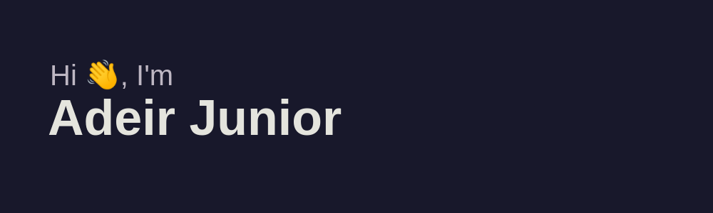

### 
I'm a SC student and front-end freelance developer 👨‍💻 working remotely since 2020 🚀
  
  

- 🔭 I’m currently working on [Brackets](https://github.com/adeirjunior/brackets)  
  

- 🌱 I’m currently learning Deno and Rust  
  

- 👯 I’m looking to collaborate on any Typescript projects🙄  
  

- ⚡ Fun fact: I spend 2 hours to find out that the error was a semicolon  
  

   

## My Skill Set  
<table><tr><td valign="top" width="50%">

### Frontend  

  
  
  
  
  
  
  
  
  
  
  
  

</td><td valign="top" width="50%">

### Backend  

  
  
  
  
  
  
  
  
  
  
  
  
  

</td></tr></table>  

## Github Stats  

Language Status

  

Activity Status

  

   

## Connect with me  

  

  
  

   

            

 

   

  
  

   
